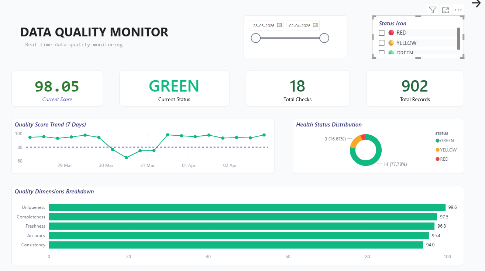
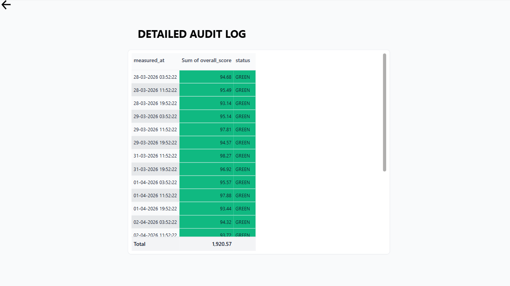
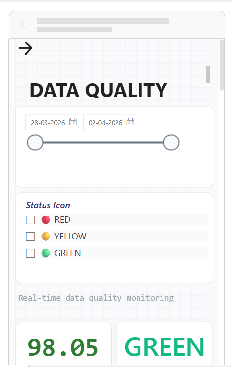
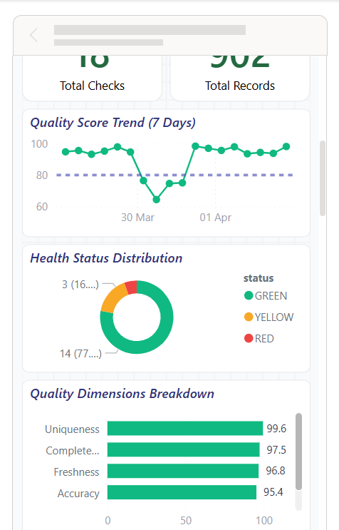

# Data Quality Scorer - Automatic Monitoring System 🚀

This project is an automated data quality monitoring system that pulls data from the **HackerNews API**, runs it through a 5-dimension scoring engine, and provides real-time Slack alerts and a Power BI-ready database.

## 📊 Dashboard Gallery

  
  
   
  
  

*The system provides real-time monitoring of data health across five weighted dimensions, categorizing batches as GREEN (Healthy), YELLOW (Warning), or RED (Critical).*

## 🧠 Quality Scoring Engine
The core of this project is a custom scoring algorithm that evaluates data batches across five critical dimensions:

1.  **Completeness (25%)**: Measures the percentage of non-null values in the dataset.
2.  **Consistency (25%)**: Uses statistical IQR (Interquartile Range) analysis to detect and penalize outliers in numerical fields like scores and comment counts.
3.  **Freshness (20%)**: Calculates the time lag between the current timestamp and the latest record's creation date to ensure data recency.
4.  **Uniqueness (15%)**: Identifies and flags duplicate records using unique source IDs.
5.  **Accuracy (15%)**: Validates the dataset against a predefined schema to ensure all required fields are present and correctly typed.

## 🛠️ Tech Stack & Capabilities
- **Backend Architecture**: FastAPI, SQLAlchemy, APScheduler. 🏗️
- **Storage**: Supabase (PostgreSQL) with optimized JSON support. 🗄️
- **Quality Engine**: Scores data based on **Completeness, Consistency, Freshness, Uniqueness, and Accuracy**. 🧠
- **Real-time Alerting**: Pushes 🟡/🔴 Slack notifications for quality drops. 🚨
- **Portfolio Ready**: Professional API documentation (Swagger) and Power BI optimized SQL views. 📈

## 🚀 Quick Launch
1.  **Configure Environment**: Copy `.env.example` to `.env` and enter your credentials (Supabase, Slack). 🛠️
2.  **Install Dependencies**: `pip install -r requirements.txt`. 📦
3.  **Start API & Monitoring**: `python -m src.api.main`. 💎

## 🌐 API Endpoints
- `/health`: System status check. ✅
- `/quality/latest/hackernews`: Most recent quality score. 📊
- `/quality/history/hackernews`: Historical data trends for Power BI. 📈

## 📂 Project Structure
- `src/ingest`: Data fetching from HackerNews and normalization. 📥
- `src/scoring`: Core quality scoring logic. 🧠
- `src/database`: Supabase persistence and models. 🗄️
- `src/api`: FastAPI server and endpoints. 🌐
- `src/alerts`: Slack notification system. 🚨
- `src/schedulers`: Automated hourly background jobs. ⏰

## 📈 Power BI Integration
See [**DATABASE.md**](./DATABASE.md) for optimized SQL queries and a step-by-step connection guide. 🎯
